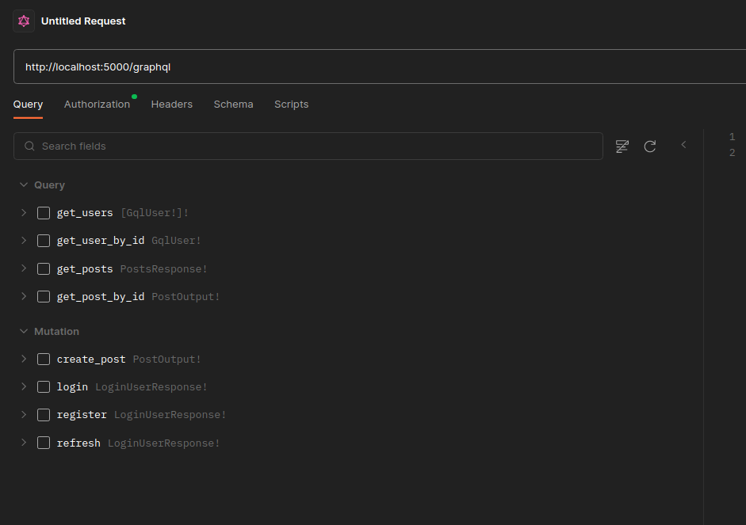
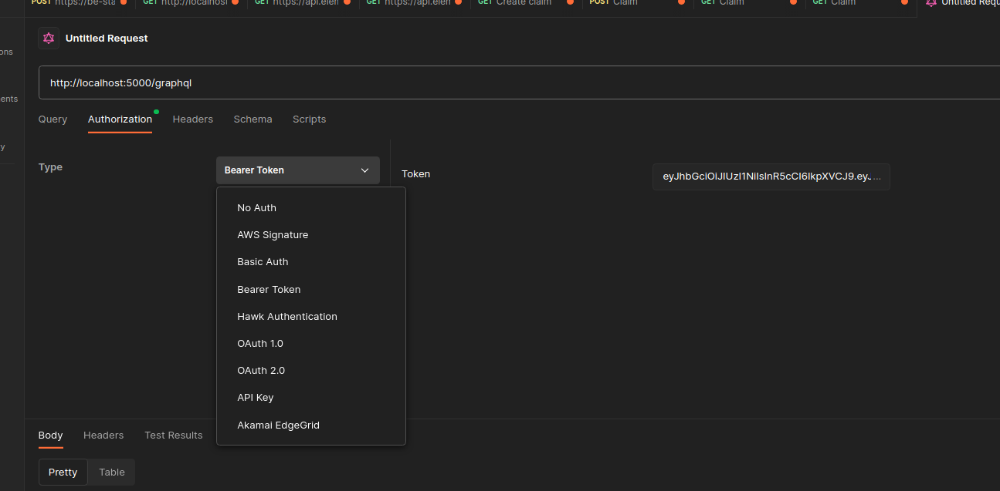

# AxMedium
*   Create .env

```
Rename .env.example to .env (if you are going to change the database name then please change it in database/init.sh script also)
```

*   Run docker containers

```
sudo docker compose up -d
```

*   Create init superuser

```
sudo docker exec -it ax_backend_api sh -c "npm run seed"
```

```
Super admin username and password: super.admin@ax.com , root
```

*   Open Postman (most recomended) and create GQL request to route http://localhost:5000/graphql (or open in browser this link) and you will see all queries and mutations



*   Please use Authorization with Bearer token


